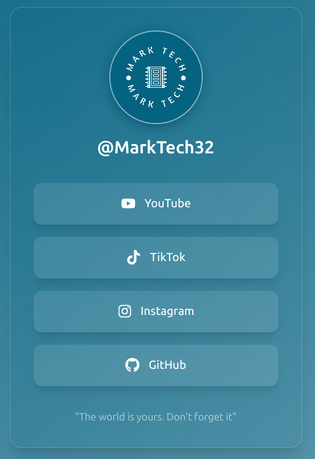

# Proyecto LinkTree Personalizado

Este proyecto es mi version de LinkTree. 

Este muestra los diferentes links a mis redes sociales con una interfaz moderna. 

## Funcionalidades

- **Enlaces Personalizables**: Muestra los links a mis distintas redes sociales como YouTube, TikTok, Instagram, y GitHub, con íconos específicos y nombres que identifican cada link.
- **Efectos de Hover y Animación**: Los links incluyen efectos visuales al pasar el mouse sobre ellos, como sombras y cambios de color para mejorar la experiencia de usuario.

## Tecnologías Utilizadas

El proyecto está desarrollado utilizando las siguientes tecnologías:

- **React**: Estructura y creación de la interfaz de usuario.
- **Tailwind CSS**: Estilización de componentes con clases utilitarias para un diseño responsivo y moderno.
- **React Icons**: Biblioteca de íconos para incorporar íconos de redes sociales.

## Uso

Para utilizar este proyecto, sigue los siguientes pasos:

1. Clona el repositorio en tu máquina local.
2. Asegúrate de tener [Node.js](https://nodejs.org/) y [npm](https://www.npmjs.com/) instalados.
3. En el directorio del proyecto, ejecuta `npm install` para instalar todas las dependencias.
4. Inicia la aplicación con `npm run dev`.
5. Abre tu navegador y entra a `http://localhost:3000` (puede aparecer otra ruta) para ver tu LinkTree personalizado.
